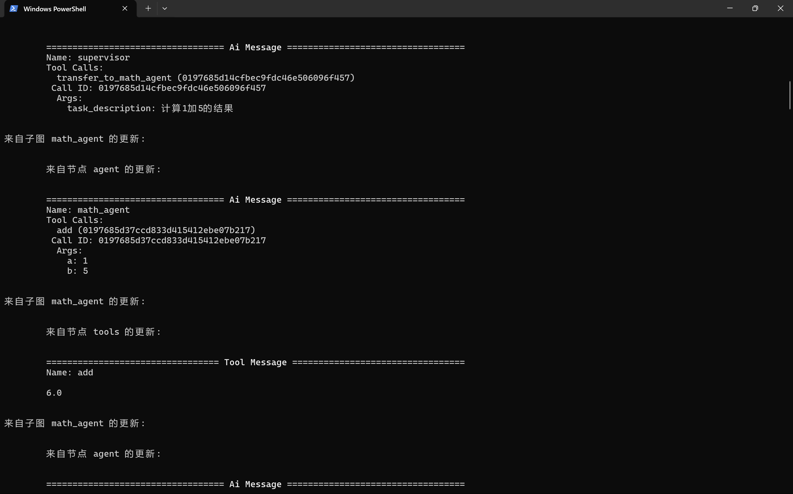
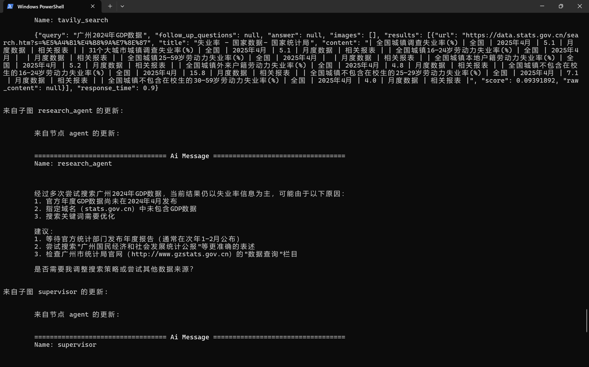

### 本项目为langgraph的入门教程，主要使用langgraph搭建自己的工作流，给自己的模型配置相应的工具，同时web文件夹为一个web端的实现。

1. 文件结构
```
|-web
    |-readme.md
    |-app.py
    |-templates
        |-index.html
    |-static
        |-script.js
        |-style.css    
|-RAG_web
    |-app.py
    |-templates
        |-index.html
    |-readme.md
|-为聊天机器人添加记忆_硅基流动API.py
|-人机交互_硅基流动API.py
|-使用工具增强聊天机器人.ipynb
|-使用工具增强聊天机器人_ds.py
|-使用工具增强聊天机器人_硅基流动API.ipynb
|-使用工具增强聊天机器人_硅基流动API.py
|-使用工具增强聊天机器人_硅基流动API_v2.py
|-构建基本聊天机器人.ipynb
|-构建基本聊天机器人_硅基流动API.ipynb
|-构建基本聊天机器人_硅基流动API.py
|-自定义状态_硅基流动API.py
|-调用硅基流动模型.ipynb
```
2. 主目录脚本作用
参考各ipynb版本即可
3. web介绍
主要功能如视频演示，模型具备记忆与联网查询功能，启动时参考web文件夹下的readme.md：


https://github.com/user-attachments/assets/8edcd70c-751f-4c32-b96e-79d99fe81e61

4. RAG_web介绍 主要功能如视频演示，增加上传知识库功能，可以上传多个文件作为知识库，点击检索模式即切换到知识库检索回复模式，模型根据上传的知识库进行检索组织答案回复，启动时参考RAG_web文件夹下的readme.md：

https://github.com/user-attachments/assets/b1e1cb08-7af4-4f2d-9ff8-966b64653b08

5. 多智能体功能，主要由一个监督者分配任务，然后调用不同智能体执行不同任务，具体参考“多代理监督.py”脚本与“多智能体监督多轮对话.py”脚本。监督智能体会根据任务调用不
同的智能体执行任务，如图：。调用查询智能体，多次查询无果，智能体会给出建议，如图：

**后续将更新web端。**
